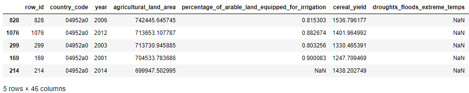

# Chronic Hunger Prediction
## - part of Microsoft Professional Program in Data Science
## Tang Quoc Thai, October 2018
### Executive Summary
This report presents the methodology and result of a prediction model to predict the annual prevalence of undernourishment at the country level from other socioeconomic indicators. The model was trained using 1401 observations of 45 variables in this dataset, within the Jupyter Notebook environment.

I conducted the preliminary descriptive statistics, and visualization of the data to find out the relationship between features following by feature selection techniques to choose the significant features for the final predictive model. The data splitting for cross-validation is intended to prevent the overfitting problem of transferring information of a country in the training subset to the test subset.

To achieve a better prediction result, the hyperparameter tuning has been applied to several models. Moreover, a stacked model method was used to smooth out the predicted results from base models.

After performing the above steps, the following conclusions could be presented:

16 significant features have been discovered and utilized in the final model.
Agriculture
* cereal_yield
* percentage_of_arable_land_equipped_for_irrigation
* total_land_area

Demographics
* population_growth
* total_population

Economics
* avg_value_of_food_production
* gross_domestic_product_per_capita_ppp
* net_oda_received_percent_gni

Education (n/a)

Food security
* caloric_energy_from_cereals_roots_tubers

Health
* access_to_improved_sanitation
* access_to_improved_water_sources
* anemia_prevalence
* obesity_prevalence
* open_defecation

Infrastructure
* access_to_electricity

Labor
* unemployment_rate

Politics (n/a)

### Initial Data Exploration
#### Split Data by ‘country_code.’
The cross-validation technique was used to prevent the overfitting; hence, the splitting train/test data is done by the K-Folds cross-validator itself. To maintain the uniqueness of country code on each fold, I sorted the imported dataset from ‘train_values.csv’ by the ‘country_code.’ And optimized the k number in K-Folds such that k is a divisor of the number of distinct ‘country_code.’

Definitely, the target values also need to be joined to the training values by the inner join method, not just concatenating as the order of rows was already changed.

    

#### Individual Numeric Feature Statistics
The summary statistics together with the histogram of 44 variables except for the identity feature that is the ‘country_code’ shows that there are three essential steps need to be applied on the dataset before training: (1) normal distribution transformation as most of the feature distributions are skewed, (2) drop features with significant amount of missing values and (3) outliers handling.

    

    

#### Target Values Statistics
It is worth to notice the statistics of the target values, ‘prevalance_of_undernourishment,’ as the significant standard deviation and difference between the median and mean could result in a wrong prediction. In this case, the log-transformation was used to preprocess the target values.

### Handle Outliers and Missing Values
The missing values were filled by imputing values technique, and the outliers were dropped based on the range of 4*sigma.

### Feature Selection
#### Drop Significant Missing Values Features
By assigning the threshold for the percentage of missing values per number of observations in a specific feature, these features were dropped.
* school_enrollment_rate_total
* tax_revenue_share_gdp
* school_enrollment_rate_female
* rail_lines_density
* inequality_index
* adult_literacy_rate
* droughts_floods_extreme_temps

#### Correlation Heat Map
The correlation heat map is an old but useful method to detect obvious correlations between features; it has been used here to find out the collinearities.

    

There are two groups of features which has strong correlation within the group ['total_labor_force', 'total_population', 'rural_population', 'urban_population'] and ['agricultural_land_area', 'total_land_area', 'forest_area'] based on the extracted information in the printout below.

    

The two features ‘total_population’ and ‘total_land_area” were kept, and the rest were dropped from the dataset.

#### Features Importance
I tested several regression models, and the XGBoost was the best performing one, afterward, it was used as the model in the feature importance analysis.
The result of this analysis is shown below, by applying a threshold on the importance, the number of features is chosen as 16 for the final model.

    

#### Recursive Feature Elimination
The RFE techniques were applied to double-check the best 16 features, whether identical with the result from XGBoost feature importance analysis. Besides, they were similar.

### Regression Model
#### Base Models
Six models have been cross-validated, with the mean and standard deviation of the RSME score as below. (Note that the target values has been log-transformed).

Neural Network score: 0.5970 (0.1084)

Lasso score: 0.5258 (0.1160)

ElasticNet score: 0.5259 (0.1160)

Kernel Ridge score: 0.6172 (0.1237)

XGBoost score: 0.5333 (0.1124)

LGBM score: 0.5599 (0.0965)

Half the number of models, including Lasso, ElasticNet, and XGBoost, were chosen as they performed better than the rest two models. In addition to that, these were further improved by using the GridSearchCV technique to find the best hyperparameter for each of them.

#### Stacked Model
Stacking (also called meta ensembling) is a model ensembling technique used to combine information from multiple predictive models to generate a new model. Often times the stacked model (also called 2nd-level model) will outperform each of the individual models due to its soothing nature and ability to highlight each base model where it performs best and discredit each base model where it performs poorly. For this reason, stacking is most effective when the base models are significantly different.

I tested three combinations from three base models above. Each case one specific model was used as a meta-model, and the rest two were used as base learner.

The result proves that the stacked model 3 performed better than individual models, the metal model in this final predictor is ElasticNet.

Stacking Averaged models_1 score: 0.5079 (0.1211)

Stacking Averaged models_2 score: 0.5945 (0.1021)

Stacking Averaged models_3 score: 0.5078 (0.1211)

In the last validation for the stacked model, the dataset was divided between training and testing subset by randomly assigning around 20% of a distinct number of ‘country_code’ and their associated observation to the test side, the rest is training data.
The result is plotted below.

    

